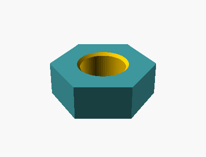
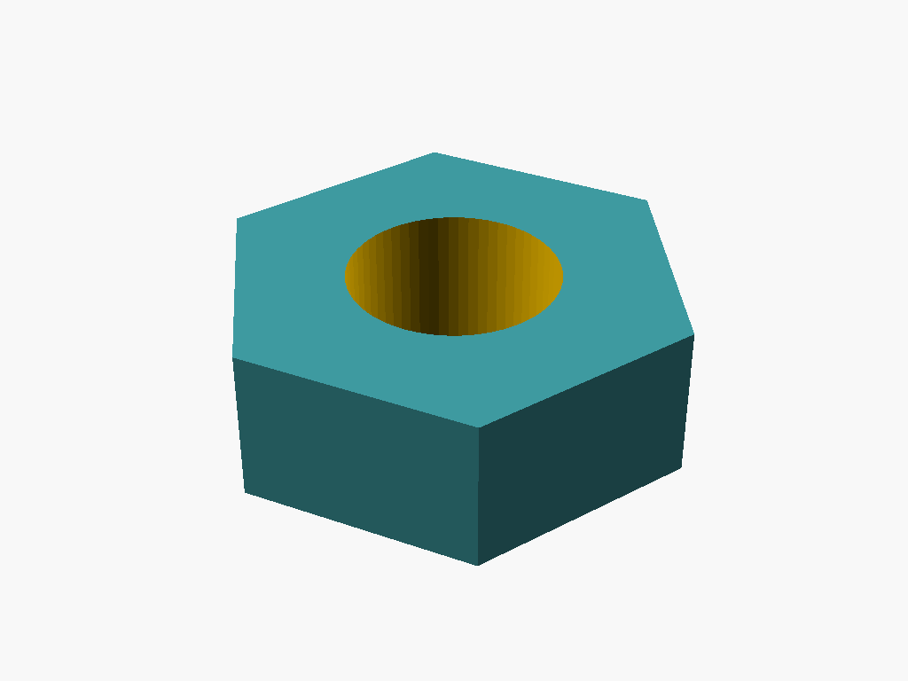
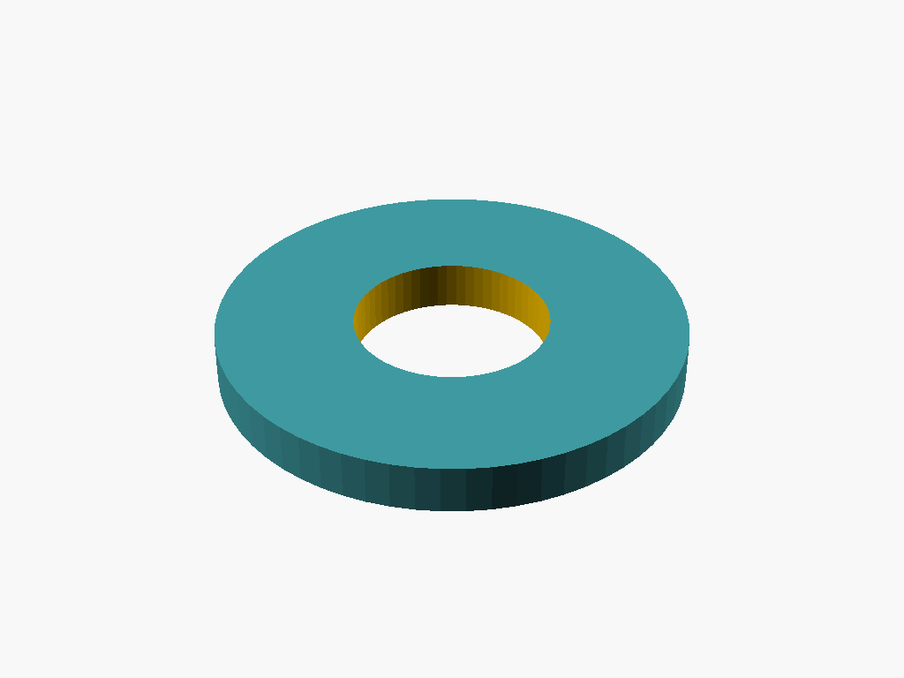
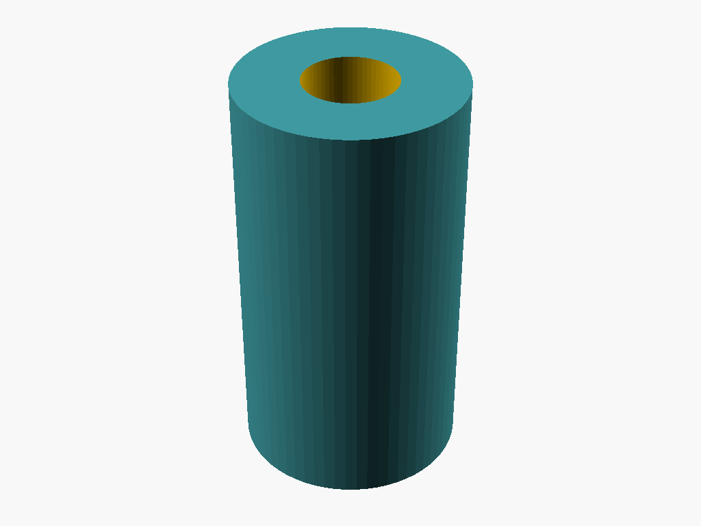
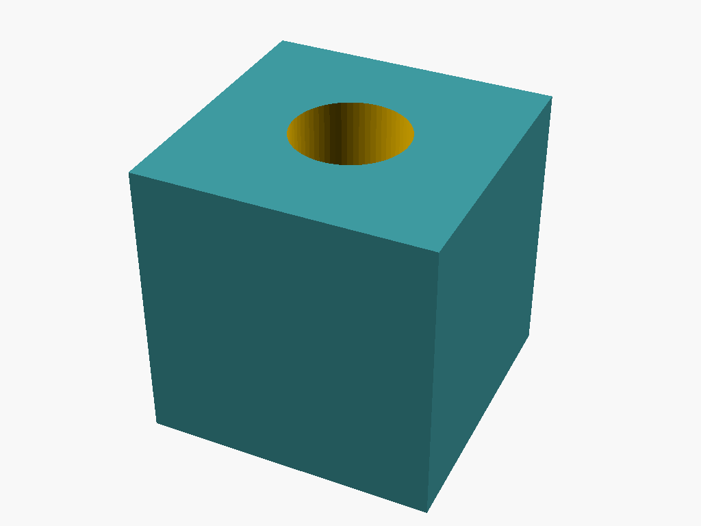
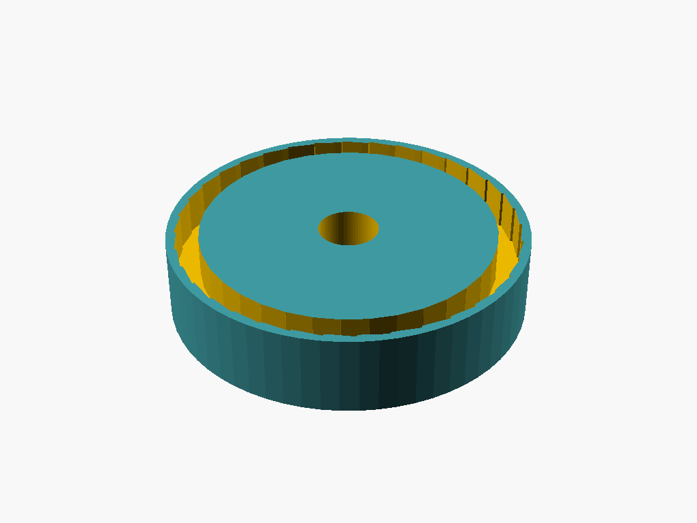

# textcad

**Natural language → OpenSCAD parametric CAD, via a fully-local agentic loop.**

[](https://github.com/dbhavery/textcad/actions/workflows/ci.yml)
[](LICENSE)
[](pyproject.toml)

<p align="center">
  
</p>

Describe a part in plain English; a local LLM writes parametric OpenSCAD; OpenSCAD
renders and exports it; and **compile, STL-export, and local vision-model gates**
feed any failure back to the model for repair — until the part is correct.

No cloud, no API keys, no telemetry. Codegen runs on a local [Ollama](https://ollama.com)
model; rendering uses the OpenSCAD binary as an external tool.

```
"a hexagonal nut, 16mm across flats, 6mm thick, 8mm center hole"
   → LLM writes parametric OpenSCAD          (Ollama, e.g. qwen2.5-coder:32b)
   → OpenSCAD renders iso + top views, exports STL
   → [compile gate] [STL-export gate] [vision-model gate]
   → a failed gate feeds specific feedback back → the model rewrites
   → ✓ correct part
```

### Self-correction in action

On the hex nut above, the model's **first** attempt was the wrong shape. The vision
gate — judging a **top-down orthographic** view (`examples/hexnut_closedloop_top.png`),
because a foreshortened isometric makes small vision models misread a hexagon as
"rectangular" — rejected it with _"not hexagonal; irregular polygonal shape"_. That
critique fed back, and **attempt 2 was approved.** No human in the loop.

### Multi-view inspection

The vision gate judges an **orthographic contact sheet** — one labelled image, like
an engineering drawing — so features on different faces are all legible at once:


### Gallery

All generated locally from a one-line description by `qwen2.5-coder:32b`:

| Hex nut | Washer | Standoff | Cube + bore | Pulley |
|:---:|:---:|:---:|:---:|:---:|
|  |  |  |  |  |

## Install

```bash
git clone https://github.com/dbhavery/textcad
cd textcad
pip install -e .

# prerequisites
#  1. Ollama running locally with a codegen model:   ollama pull qwen2.5-coder:32b
#  2. (optional, for --inspect) a vision model:        ollama pull qwen2.5vl:7b
#  3. an OpenSCAD binary on PATH, or set $TEXTCAD_OPENSCAD,
#     or drop a portable build under tools/openscad-*/
```

## Usage

```bash
# compile-only loop (fast; accepts the first part that compiles and exports)
textcad "a flat washer, 24mm outer, 10mm hole, 2.5mm thick" --model qwen2.5-coder:32b

# full closed loop with the local vision inspector
textcad "a hexagonal nut, 16mm across flats, 6mm thick, 8mm center hole" \
    --model qwen2.5-coder:32b --inspect qwen2.5vl:7b --iters 4

# compare codegen models on a fixed part set
python scripts/bench.py qwen2.5-coder:32b
```

Outputs: `out/<name>.scad`, `out/<name>.png` (iso), `out/<name>_top.png`
(top-down, for the inspector), `out/<name>.stl`.

## The three gates

Each iteration runs the gates in order; a failure feeds targeted text back to the
next generation:

1. **Compile** — OpenSCAD must render a preview; the compiler `stderr` feeds back.
2. **STL export** — must produce a non-empty STL. Catches mixed 2D/3D and
   non-manifold geometry that previews fine but won't export.
3. **Visual inspector** *(optional, `--inspect`)* — a local VLM judges the part
   against the request and rejects valid-but-*wrong* shapes (a round disc when a
   hexagon was asked for) that the first two gates can't see. It inspects an
   **orthographic contact sheet** — top, front and side views composited into one
   labelled image (like an engineering drawing). This matters: a small VLM misreads
   a foreshortened isometric, and gets *confused* by several separate images, but
   reads one labelled multi-panel sheet reliably — enough to catch a missing
   perpendicular leg or a wrong cross-section. (Contact sheets need Pillow:
   `pip install textcad[inspect]`.)

## Library API

```python
from textcad import run, make_vlm_inspector

result = run(
    "a hexagonal nut, 16mm across flats, 6mm thick, 8mm center hole",
    model="qwen2.5-coder:32b",
    inspector=make_vlm_inspector("qwen2.5vl:7b"),  # omit for compile-only
    iters=4,
)
print(result["stl"], result["attempts"])
```

Every layer takes an injectable backend (`llm=`, `inspector=`), so the loop is
unit-tested with no Ollama and no OpenSCAD — see `tests/`.

## Layout

```
textcad/
  llm.py        minimal local-Ollama client (text + vision, multi-image)
  codegen.py    system prompt + OpenSCAD code generation
  render.py     OpenSCAD invocation: iso/ortho views + STL + contact sheet
  inspector.py  local vision-model judge (orthographic contact sheet)
  loop.py       the agentic loop + the three gates
  cli.py        `textcad` command
scripts/bench.py  fixed-part-set model comparison
tests/            mock-backed gate-logic + codegen + inspector tests
```

## What works, what doesn't (honest findings)

- The closed loop is **verified end-to-end and fully local.** On a hex nut it
  self-corrected a wrong shape into an approved correct part in two attempts.
- **Codegen model matters, and is now the bottleneck.** `qwen2.5-coder:32b` produces
  real regular polygons and uses `difference()` natively (a smaller `qwen3:14b` makes
  wedges and skips subtraction). It's reliable on single-feature parts but still
  struggles to *generate* multi-feature parts (perpendicular legs, D-profile shafts,
  grooves) even with critique feedback, and is non-deterministic.
- **Inspection is solved for multi-feature parts** via the orthographic contact
  sheet: where a 7B VLM failed on both a single isometric and a raw 3-image call, it
  correctly approves a real L-bracket and rejects a flat L-plate from one labelled
  contact sheet. The remaining gap is generation, not inspection.
- A *larger* VLM (`qwen2.5vl:32b`) needs a newer Ollama than tested here (0.30.10
  fails to load its vision encoder); the contact-sheet trick made the small VLM
  sufficient, so it isn't required.

Natural next steps: a stronger/larger codegen model (or a part-template library) for
complex multi-feature parts, and a parameter-slider UI over the named OpenSCAD vars.

## License & provenance

MIT — see [LICENSE](LICENSE). textcad is a **clean-room** project: it reproduces a
general *pattern* (LLM writes CAD code → render → inspect → iterate) but contains no
third-party source. The OpenSCAD binary is invoked as an external tool, so textcad
is an independent work and inherits **no GPL obligations**.
